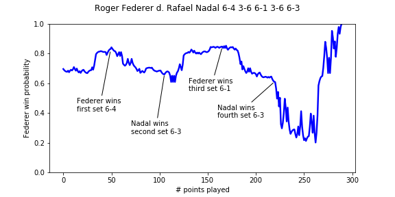

# tennis_match_prediction

To run the pre-match prediction, run the following command in the terminal

python match_df_construction_bookmaker.py --test_year 2010 2011 2012 2013 2014 2015 2016 2017 2018 2019

This will generate elo ratings from 2001 to 2019, and print out prediction accuacies from 2010 to 2019. 

To update K with the three additional features described in the report, please uncomment the code in rate() in elo_538.py. Detailed description on the three features can be found in Tennis_Prediction.pdf

Data can be downloaded [here](https://drive.google.com/file/d/12gmvB41brLibGojE5pHbLsmsgT7jS_ix/view?usp=sharing).

========Below is the original README===========

		2017 Australian Open Men's Singles Final

Accurate in-match prediction for tennis is important to a variety of communities, including sports journalists, tennis aficionados, and professional sports betters. In-match prediction consists of the following estimate:  given any score between two players and all historical information about the two players, what is the probability that each player wins the match? While win-probability graphs have recently received more attention in football (see Brian Burke's http://www.advancedfootballanalytics.com) and baseball, they still receive little exposure in tennis, because strong tools for their prediction have not been implemented and been made widely available (until now!).

This project explores new approaches and also implements known methods, evaluating models on tens of thousands of ATP/WTA matches from the twenty-first century. No prior published papers have compared the effectiveness of in-match prediction models at this scale before. Because an effective pre-match forecast forms the starting point for an in-match model, I explore match prediction in two steps: pre-match prediction and in-match prediction.  The technical implementation details are further described in 'requirements.txt'.  Instructions on running the code and interpreting the results can be found in 'get_started.txt'.

All tennis match and point-by-point datasets are supplied by Jeff Sackmann, and you can access them at https://github.com/JeffSackmann/. Together, this code produces relevant player information (eg player's elo, serve/return percentages over the past twelve months heading into a match) for any tour-level match from 1968-present. Then, approaches and results are documented in 'pre_match_predictions.ipynb' and 'in_match_predictions.ipynb'.

Please provide attribution for any use of this code.

You can reach me at jacobgollub@college.harvard.edu
